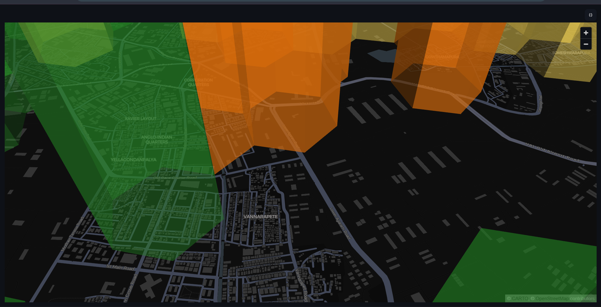

# TrafficEye Command 👁️🚦
**Flipkart Gridlock Hackathon 2.0 — Round 2 Command Center Prototype**
*AI-Driven Hotspot Detection &middot; Physics-Informed Congestion Scoring &middot; Resource-Constrained Enforcement Optimization*

---

## 📖 Executive Summary
**TrafficEye Command** is an interactive, double-theme Command Center Dashboard designed for traffic department administrators. It transforms raw illegal-parking enforcement records (~298K rows) into a spatial-temporal, physics-informed enforcement priority system.

Rather than relying on basic violation counts or reactive patrols, **TrafficEye Command** combines **unsupervised KMeans clustering**, **Greenshields & Lighthill-Whitham-Richards (LWR) traffic flow models**, and **economic delay cost benchmarks** (TERI) to prioritize city-wide hotspots, predict future enforcement needs, and program optimal patrol shifts under resource constraints.

---

## 📸 Command Center Dashboard Views

### 1. City-Wide 3D Enforcement Priority Map (Dark Theme)
The default dark-mode cockpit is designed for command center screens, displaying high-fidelity neon KPI cards and a 3D hexagonal elevation map showing coordinate-binned violation hotspots.


### 2. Light Theme Layout
A clean, high-contrast, off-white theme with dark slate typography and a specialized light map style for day-shift operators.
.png)

### 3. Priority Enforcement List & Table
A sorted, drillable ledger listing the top binned locations, their physics capacity loss, estimated economic delay costs, and spatial-temporal traits.
.png)

### 4. Spatiotemporal Heatmaps & Tag Breakdown
Empirically identifies peak violation hours and days of the week, alongside a breakdown of active violation tags (e.g., Wrong Parking vs. Double Parking).
.png)

### 5. Animated Hour-of-Day Violation Map
An interactive scatter-plot map showing spatial concentrations of violations across Bengaluru hour-by-hour.
* **Peak Hour (10:00 IST)**: High spatial congestion.
  .png)
* **Off-Peak Hour (04:00 IST)**: Sparse, night-shift logging patterns.
  .png)

### 6. Hotspot Drill-Down & Physics KPI Panel
Allows users to click any hexagon to inspect local violation types, recommended mitigation strategies, and estimated traffic speed bottlenecks.
.png)

### 7. Next 2-Week Forecasting
A linear regression trend model projecting weekly violation counts forward for early hotspot detection.
.png)

### 8. Resource-Constrained Patrol Optimizer
Input available police personnel and shift budgets to calculate the mathematically optimal patrol assignment schedule to recover the most congestion score.
.png)

### 9. What-If CIS Formula Adjuster
Recalculates priorities in real-time by tuning sliders for severity, junction, busy-hour, and persistence weights.
* **Real-time Adjuster**:
  .png)
* **Rank Delta & Biggest Movers Callout**:
  .png)

---

## ⚡ Technical & Mathematical Foundation

### 1. Spatial Binning (Uber H3 Index)
Addresses are often recorded inconsistently. TrafficEye Command aggregates coordinates into **Uber H3 hexagonal cells** (defaulting to resolution 9, which represents ~0.1 km²). This creates a standardized spatial database, making visual analysis and machine learning calculations highly reproducible.

### 2. The Congestion Impact Score (CIS)
A 0–100 score computed via a weighted average of percentile ranks across four key indicators:
* **Obstruction Severity ($S$)**: BTP tags weighted by road obstruction potential (e.g., *Double Parking* = 3.0, *Footpath Parking* = 1.0).
* **Junction Proximity ($J$)**: Fraction of violations near named road junctions.
* **Busy-Hour Share ($H$)**: Fraction of violations logged during empirically busiest windows.
* **Persistence Ratio ($P$)**: Ratio of days with violations to total observation days.

$$\text{CIS} = 40\% \text{ Severity} + 20\% \text{ Junction} + 20\% \text{ Busy-Hour} + 20\% \text{ Persistence}$$

An unsupervised **KMeans model** fits these metrics to classify hotspots into **Critical, High, Medium, and Low** priority tiers.

### 3. Physics-Informed Bottleneck Modelling
TrafficEye Command translates static parking logs into traffic bottlenecks using classic traffic flow models:
* **Greenshields Linear Speed-Density Model (1935)**:
  $$u = u_f \left(1 - \frac{k}{k_j}\right)$$
  * $u$: Estimated through-traffic speed (km/h)
  * $u_f$: Free flow speed (assumed 40 km/h)
  * $k$: Current traffic density (vehicles/km), derived by scaling binned violation severity.
  * $k_j$: Jam density (assumed 120 vehicles/km)
* **Lane Capacity Loss %**: Ratio of capacity lost due to active lane blockage.
* **Lighthill-Whitham-Richards (LWR) Shockwave Queue (km)**: Computes the length of the queue of vehicles backpropagating upstream from the bottleneck:
  $$w = \frac{q_b - q_a}{k_b - k_a}$$
  Where $w$ is the shockwave speed, and the queue is accumulated over the active parking duration.

### 4. Economic Cost Quantifier (TERI standard)
To justify enforcement costs, TrafficEye Command translates vehicle delays into monetary impact using **The Energy and Resources Institute (TERI) urban traffic benchmark** (₹50 per vehicle-hour delay). It estimates the daily delay cost ($C_d$) per hotspot:
$$C_d = \text{vehicles impacted} \times \text{delay time (hours)} \times \text{₹50}$$
This is aggregated to report the city-wide annual delay cost (e.g., ₹0.2 Crore for the 25k sample dataset).

### 5. Greedy Patrol Scheduler
Formulated as a budget-constrained optimization problem:
* Critical hotspots require **2 officer-hours**.
* High / Medium / Low hotspots require **1 officer-hour**.
* **Objective**: Allocate officer hours to maximize the total CIS recovered:
  $$\max \sum_{i \in A} \text{CIS}_i$$
  TrafficEye Command uses a **greedy search algorithm** (re-sorting hotspots by marginal CIS return per hour and packing the schedule until the budget is exhausted), outperforming random officer deployment by **+20%** efficiency.

---

## 🛠️ Codebase Structure

```
traffic-eye-command/
├── app.py               # Streamlit Command Center (CSS injection, layouts, reactive maps, page components)
├── data_pipeline.py     # Data cleaning, tag parser arrays, and severity weighting logic
├── hotspot_engine.py    # H3 Hex binning, Greenshields & LWR math, TERI costing, KMeans, and greedy optimizer
├── requirements.txt     # Python environment requirements
├── data/
│   └── sample_violations.csv   # Bundled 25k-row random sample for immediate demonstration
└── screenshots/         # Dashboard visual artifacts (11 files)
```

---

## 🚀 Quick Start

### 1. Installation & Launch
Ensure Python 3.10+ is installed, then clone this repository and run:
```bash
# Install dependencies
pip install -r requirements.txt

# Run the Streamlit dashboard locally
streamlit run app.py
```

### 2. Loading the Full Dataset
By default, the dashboard runs instantly using the bundled 25k sample. To use the full dataset:
1. Place the full anonymized CSV file (e.g., `jan_to_may_police_violation_anonymized791b166.csv`) in the `data/` directory.
2. Open the dashboard in your browser (`http://localhost:8501`).
3. In the sidebar, select **Custom CSV path** and input the path to your file.
4. The first run takes ~20 seconds to pre-compute H3 coordinates and KMeans models; subsequent loads are instantly retrieved from the Streamlit cache.

---

## 🛡️ Limitations & Future Roadmap
* **Sensor/GPS Telemetry Proxy**: This dashboard estimates congestion speed and queue length using traffic flow models (Greenshields/LWR) rather than live road sensors.
* **Timestamp Logging Caveat**: Logging times represent when records were saved in the police system, which might lag behind actual traffic violations. Incorporating real-time camera feeds (YOLOv8) will eliminate this constraint.
